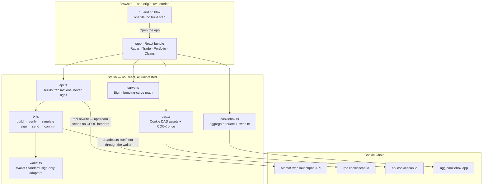
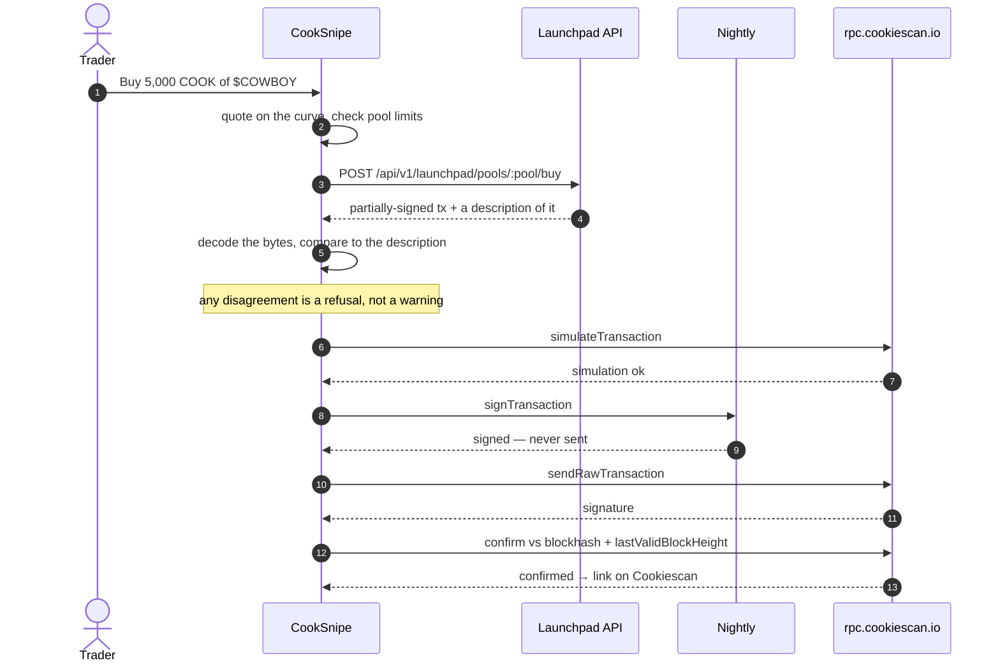

<div align="center">


# CookSnipe

**New tokens on Cookie Chain are born, graduate or die inside a week — and getting in, getting out
and collecting what the launchpad owes you means bouncing between three different sites.
CookSnipe does all three in one screen, on chain.**

[](LICENSE)
[](https://github.com/thesithunyein/cooksnipe/actions/workflows/ci.yml)
[](#testing)
[](#cookie-chain-integration)
[](#required-features-as-the-bounty-lists-them)
[](tsconfig.json)
[](#scripts)

[**Live app**](https://cooksnipe.sithunyein.com/app) &nbsp;·&nbsp;
[Landing](https://cooksnipe.sithunyein.com/) &nbsp;·&nbsp;
[Program on Cookiescan](https://cookiescan.io/address/momoL7wu4TrXjnXMLCLzGsbx8Pm7XGgoYo7FVqDoqcw) &nbsp;·&nbsp;
[RPC](https://rpc.cookiescan.io)

</div>

---

## The problem

A launch on the [MomoSwap](https://momoswap.fun) bonding curve moves fast, and the money involved
goes in four different directions that no single page shows you:

- **Entry and exit.** The launch page shows a pool; the curve sell is a separate action; the SPL
  tokens come later, if the pool graduates.
- **Refunds.** In fair mode, a pool that expires without graduating owes its holders the entire
  raise back, pro-rata. Nothing tells you it happened.
- **Settlement payouts.** Jackpot and survivor pools pay out through a merkle root. If you are in
  it, only a proof you have to go looking for will release the money.
- **Creator money.** Trade fees accumulate in a fee vault, and the vest unlocks on a schedule. Both
  sit there silently until claimed.

So traders either watch pools they shouldn't, or leave refunds and fees unclaimed because there is
no screen that lists them.

## What it does

| | | |
|---|---|---|
| **Radar** | Every pool on the launchpad, polled live, sorted by state; new launches are flagged as they appear. |
| **Trade** | Buy and sell on the bonding curve with your own wallet — Nightly first — with a local quote, pool limits checked before you sign, six-stage progress, and an explorer link on confirmation. |
| **DEX exit** | For pools that graduated, an exit route quoted through the **Cookiebox** aggregator, with fee, price impact and the split path shown before signing. |
| **Portfolio** | Every curve position for an address, with invested / returned / open value read straight from the position account, plus the wallet's real token balances from the **Cookie DAS** index. |
| **Claim Center** | One scan that finds refunds, settlement payouts, graduated tokens, creator fees and creator vest across every pool — and claims them, or claims them all in sequence. |

## Architecture



The dashed line that matters is between `wallet.ts` and `rpc.cookiescan.io`: the wallet is used only
to **sign**. Everything that touches the network happens in `tx.ts`, over Cookie Chain's own RPC.

### The transaction lifecycle



| Stage | What the user sees |
|---|---|
| 1 · Quote | Local curve price, fee and resulting tokens, before anything is signed |
| 2 · Limits | Pool caps and wallet balance checked client-side, so an impossible order never reaches a wallet prompt |
| 3 · Build | Unsigned transaction returned by the launchpad API |
| 4 · Verify | Decoded and compared against the API's own description, then simulated |
| 5 · Sign | The wallet signs; CookSnipe broadcasts |
| 6 · Confirm | Confirmation tracked against the blockhash **and** `lastValidBlockHeight`, so an expired transaction says so instead of hanging |

## Two entries, one design

| Path | What it is |
|---|---|
| `/` | **The landing** — one self-contained `public/landing.html`: no build step, no dependencies, no framework. Scrolling does not move the page content; it scrubs a fixed full-screen video frame by frame while three text panels cross-fade over it. The clip is all-intra (every frame is a keyframe), which is why a seek lands on an exact frame instantly, and the spaces between panel cues are deliberate dead zones so two panels are never readable at once. |
| `/app` | **The product** — `app.html` plus the Vite/React bundle: radar, trade, portfolio, claim center. |

Both wear the same system: paper `#f2f0ec`, ink `#0d0c0b`, Inter Tight at 400/500 only, hairline
rules, dark ink pills, tight negative letter-spacing on display type. The landing's copy, cue timings
and video URL sit in one clearly marked block at the top of its script, and `.track { height:560vh }`
is the knob for how slow the scrub feels.

That system is one set of tokens and habits rather than two matching paint jobs. `src/index.css`
holds them — `.paper-grain`, `.chrome-fade`, `.foot-fade`, `.meter`, `.boot`, `.label`, `.display`,
`.nav-link`, `.btn-ink`, `.chip`, `.field` — and the app's header, footer, scroll meter and preloader
are the landing's own chrome. The mark is one shape in three places (`public/mark.svg` for anything
outside React, `src/app/Mark.tsx` for the app, inlined in `landing.html` so it needs no request); it
is single-colour and inherits `currentColor`, so the same file works on paper and on ink.

Routing is handled twice on purpose: `vercel.json` rewrites for production, and a tiny middleware in
`vite.config.ts` for `dev`/`preview`, so the two routes behave identically however you run it.

## Required features (as the bounty lists them)

- **Wallet connection** — Wallet Standard discovery (`@wallet-standard/app`) with an
  injected-provider fallback. Nightly, Phantom, Backpack and Solflare are all detected; **Nightly is
  what Cookie Chain supports** and is highlighted in the picker, with an install link when nothing is
  detected.
- **Display the connected wallet address** — in the header, one click to copy, one click to open it
  on Cookiescan.
- **Transaction execution** — buy, sell, four claim kinds, creator-fee claims, and Cookiebox swaps,
  all built as unsigned transactions and signed by the user's wallet.
- **Transaction confirmation handling** — confirmation is tracked against the blockhash **and**
  `lastValidBlockHeight` the builder returned, so an expired transaction is reported as expired
  instead of hanging.
- **Error handling and user feedback** — program errors are translated into sentences ("Not enough
  COOK in this wallet to cover the amount plus network fees"), every stage is visible while it runs,
  and the RPC is checked against Cookie Chain's genesis hash before any signature is requested.

## How it stays safe

**1. The wallet signs; CookSnipe broadcasts.** Wallets broadcast through their own RPC. On a custom
SVM chain that RPC is Solana mainnet, where the transaction silently never confirms. So this app
calls `signTransaction` only, then sends over `rpc.cookiescan.io` itself, and confirms there.

**2. Transactions are verified before they are signed.** The launchpad API returns a partially-signed
transaction *plus* a description of it: fee payer, per-instruction program id, account order with
signer/writable flags, and the SHA-256 of each instruction's data. CookSnipe decodes the bytes it was
handed and compares them to that description — any disagreement (different program, changed data, a
fee payer that isn't you, an account that just became writable) is a refusal, not a warning. Then it
simulates before asking for a signature. `src/lib/tx.test.ts` covers the tamper cases.

## Cookie Chain integration

| | |
|---|---|
| **Launchpad program** | `momoL7wu4TrXjnXMLCLzGsbx8Pm7XGgoYo7FVqDoqcw` (`api.momoswap.fun/v1/launchpad`) |
| **RPC / WS** | `https://rpc.cookiescan.io` · `wss://wss.cookiescan.io` |
| **Genesis hash** | `9wDaBRDgArEUpvhHxGguNkwozsZh4UpGZB9o2EoEcBB2` — asserted before signing |
| **Cookie DAS** | `api.cookiescan.io` — `getAssetsByOwner` for wallet balances, `/api/price/cook` for the COOK/USD figure next to claimable amounts |
| **Cookiebox** | `agg.cookiebox.app` — `/quote` and `/swap-tx` for the post-graduation exit |
| **CookieSwap** | `cookieswap.fun/api/verify/tokens` — the ecosystem's verified-token registry, CORS-open so the browser reads it directly. Launches it has vetted get their real logo and a green `verified` chip on the radar; 2 of 12 live pools matched at the time of writing. Logos are IPFS-pinned, so a failed gateway is retried once through another |
| **Cookiescan** | every transaction, address and mint in the UI links to `cookiescan.io` |
| **Bridge** | linked in the footer for anyone arriving without COOK |

One structural note: on Cookie Chain the native mint is
`So11111111111111111111111111111111111111112` — the *same string* as wSOL on Solana. The app branches
on the chain, never on the mint.

## The claim-log program (`program/`)

**Deployed and live on Cookie Chain.**

| | |
|---|---|
| **Program address** | `AQnozqcJTp75LogCWQhCc4bKhgZChAqF9HHBLNNqun85` |
| **Deploy transaction** | [`4FJ4h3HM…eKe`](https://cookiescan.io/tx/4FJ4h3HMa5o16sxLTw27n3cTk4DxKYX8RVG3gPfzRTZzVBQbBgYChHzmB77Ab9ySBZn6GqwwqhsJc1Rc3wpGseKe) |
| **Loader** | `BPFLoaderUpgradeab1e11111111111111111111111` (upgrade authority held by the deploy keypair) |
| **Artifact** | 32,280-byte ELF, verified executable via `getAccountInfo` |

The real cost was measured before it was paid. Running the deploy with an unfunded payer fails at
exactly one line and reports the requirement itself:

```
Error: Account DWfUjm…DVTh has insufficient funds for spend
       (0.22587288 SOL) + fee (0.00018 SOL)
```

That 0.2259 COOK is the buffer, refunded when the buffer closes; the program data account costs about
the same again and is permanent. **The completed deploy consumed 0.227 COOK**, leaving 0.7728 of the
1 COOK a community member sent for exactly this purpose.

The program is one instruction. `RecordClaim` appends a receipt — claimer, pool, claim kind, raw
amount, slot — to an account seeded by `["cooksnipe", wallet, pool]`. It moves no lamports, makes no
CPI, and exists so the Claim Center's answers are auditable on-chain instead of being taken on trust
from CookSnipe's own UI.

Its logic is verified on chain, not just its deployment. A real signed `RecordClaim` was sent and
confirmed ([`sSWQUnEw…tRM`](https://cookiescan.io/tx/sSWQUnEw91F3DvsaXhUCMCqP6ZtSo12UKGKRKknJ7LWYD1LAX6pnCoL66BS1LPfjRQ1pTaSXyN9faBf9YdfktRM),
slot 26230804, `Status: Ok`, 0.0015 COOK):

```
Program log: cooksnipe claim #1 recorded at slot 26230804
Program AQnozqcJTp75LogCWQhCc4bKhgZChAqF9HHBLNNqun85 consumed 1982 of 202850 compute units
Program AQnozqcJTp75LogCWQhCc4bKhgZChAqF9HHBLNNqun85 success
```

The receipt account it wrote is readable by anyone from the chain alone:

```
address   Cum4DpEr6Z7wGQddDVY12DjnPaKFXSeZmikgfEN83YgT
owner     AQnozqcJTp75LogCWQhCc4bKhgZChAqF9HHBLNNqun85   size 85 bytes
records   1
claim #1  kind=0   amount=10022 COOK
```

That is the point of the program: a claim result the app reports can be checked against an account it
cannot rewrite, rather than taken on trust from CookSnipe's own UI.

One design caveat, stated rather than hidden: the instruction checks `receipt.is_signer`, so it is
reachable with a **client-signed receipt account owned by the program**, not with a bare PDA — a PDA
cannot sign for itself from a client. The `receipt_pda()` helper documents the PDA layout the program
uses for its seed derivation, but a caller must pass a signer. Switching the check to verifying the
PDA's seeds (or routing through `invoke_signed`) is the fix if the PDA form is wanted.

```bash
cd program
cargo build-sbf            # → target/deploy/cooksnipe_claimlog.so
node deploy-program.mjs    # PAYER_KEYPAIR / RPC_URL override the defaults
```

The script generates the program keypair once, checks the payer balance against the measured rent,
runs `solana program deploy`, then reads the account back from the chain and prints the address. It
is idempotent and needs the Solana CLI on `PATH`.

It shells out to the CLI rather than hand-rolling the BPF-loader instructions on purpose. An earlier
version of this file built the buffer and program accounts itself and could not work: it imported
`MAX_PERMIT_DATA_LENGTH` and `BPF_LOADER_BUFFER_PROGRAM_ID` from `@solana/web3.js`, both of which were
removed in 1.99, so the program account was created with `space: undefined` and its rent came from
`NaN`. The CLI's deploy path is exercised by every Solana program in existence, sizes the accounts
to the artifact rather than to a 10 MB ceiling, and is verified against this chain.

> **The deploy writes `program/program-keypair.json`, which holds the program's secret key and is
> therefore its upgrade authority. It is gitignored. Never commit or share it** — losing it means the
> program can never be upgraded, and leaking it means someone else can redeploy over it.

The newer dependencies are pinned in `Cargo.toml` because the SBF toolchain's rustc is 1.79 and
predates edition2024; the comment there explains the pins and when to drop them.

## Quickstart

```bash
git clone https://github.com/thesithunyein/cooksnipe
cd cooksnipe
npm install
npm run dev            # http://localhost:5173
```

Then open `http://localhost:5173` for the landing and `http://localhost:5173/app` for the app.

No environment variables and no keys. `.env*` is gitignored; if a `.env.local` exists it is a Vercel
CLI artifact, not something the app reads. The launchpad API is proxied through `/api` in dev
(`vite.config.ts`) and by a rewrite in production (`vercel.json`), because the upstream sends no CORS
headers. Cookie DAS and the Cookiebox aggregator do send CORS headers, so they are called directly.

### Scripts

| Command | What it does |
|---|---|
| `npm run dev` | Vite dev server, both routes, `/api` proxied to the launchpad |
| `npm test` | Vitest: 23 unit tests over the curve math and the transaction verifier |
| `npm run test:watch` | The same suite in watch mode |
| `npm run build` | `tsc --noEmit && vite build` → `app.html` + `landing.html` |
| `npm run preview` | Serve the production build on the same two routes |

## Project structure

```
cooksnipe/
├── app.html                      the app's document — the landing owns the root path
├── package.json
├── tsconfig.json
├── vite.config.ts                two entries + the /api proxy for dev and preview
├── vercel.json                   the same routes + the /api rewrite in production
├── LICENSE                       MIT
├── program/                      Rust claim-log program — built, not deployed (see above)
│   ├── Cargo.toml                solana-program 2.1.21, with the edition2024 pins documented
│   ├── src/lib.rs                one instruction: RecordClaim appends a receipt to a PDA
│   ├── deploy-program.mjs        builds, deploys via the Solana CLI, verifies, prints the address
│   └── program-keypair.json      NOT COMMITTED — the program's secret key, gitignored
├── public/
│   ├── landing.html              the scroll-scrubbed landing — one file, edit it directly
│   ├── mark.svg                  the mark: one colour, inherits currentColor, knocked-out bite
│   ├── favicon.svg               the mark on a paper tile — the browser tab
│   ├── favicon-32.png            the same tile rasterised, for browsers without SVG favicons
│   ├── apple-touch-icon.png      iOS home-screen icon
│   ├── cooksnipe.png             512px tile, also the registry logo
│   └── og.png                    1200×630 social card, in the landing's own type and palette
└── src/
    ├── main.tsx                  React entry
    ├── App.tsx                   error boundary + AppView
    ├── index.css                 the design system: tokens and component classes
    ├── lib/                      no React, all testable
    │   ├── chain.ts              the only place that talks to the RPC; genesis guard; explorer URLs
    │   ├── api.ts                launchpad HTTP client — builders only, never signs
    │   ├── tx.ts                 build → verify → simulate → sign → send → confirm
    │   ├── wallet.ts             Wallet Standard + injected discovery, sign-only adapters
    │   ├── curve.ts              BigInt port of the on-chain bonding-curve rounding
    │   ├── cookiebox.ts          aggregator quotes and swap transactions
    │   ├── cookieswap.ts         CookieSwap's verified-token registry + IPFS gateway fallback
    │   ├── das.ts                Cookiescan DAS assets + COOK price
    │   ├── types.ts              the shapes the API returns, in one place
    │   ├── format.ts             number, price and address formatting
    │   ├── demo.ts               deterministic demo feed for when the API is quiet
    │   ├── curve.test.ts         curve math against the reference implementation
    │   └── tx.test.ts            the transaction verifier, including the tamper cases
    └── app/                      UI
        ├── AppView.tsx           shell, chrome, tabs, URL state, footer
        ├── Mark.tsx              the mark as a component
        ├── Radar.tsx             the live pool feed, with CookieSwap's verified marks
        ├── useVerified.ts        loads CookieSwap's verified tokens once, never blocks the feed
        ├── TokenDetail.tsx       one pool: curve, stats, trade panel
        ├── BondingChart.tsx      live price chart (lightweight-charts, paper palette)
        ├── TradePanel.tsx        buy and sell on the curve
        ├── DexExit.tsx           Cookiebox exit for graduated pools
        ├── Portfolio.tsx         positions and token balances for an address
        ├── Claims.tsx            the claim center
        ├── WalletButton.tsx      connect, address, copy, explorer
        ├── useLaunches.ts        polling feed
        ├── useTx.ts              one transaction pipeline, reused by every action
        └── useWallet.ts          wallet state
```

State is deliberately plain: polling in `useLaunches`, wallet state in `useWallet`, and transactions
in `useTx` — one pipeline, reused by every action, so the progress and error behaviour is identical
everywhere.

## Testing

```bash
npm test
```

23 tests across two files, aimed at the two places a wrong answer costs money:

- **`curve.test.ts`** — the bonding-curve math is a BigInt port of the on-chain rounding, checked
  against the reference implementation, including the fee split and the boundary cases at each end of
  the curve.
- **`tx.test.ts`** — the verifier that stands between the API and your signature: a swapped program
  id, mutated instruction data, a different fee payer, an account that quietly became writable, and a
  description that does not match the bytes are all refused.

## Deployment

```bash
vercel deploy --prod
```

The rewrite in `vercel.json` is what keeps the API reachable in production — Vercel serves a matching
static file before applying any rewrite, which is also why the Vite entry is `app.html`: an
`index.html` in the build output would keep winning the root path and the landing would be
unreachable.

| Route | Serves |
|---|---|
| `/` | `landing.html` — the scroll-scrubbed landing |
| `/app` | `app.html` — the product |
| `/api/*` | `api.momoswap.fun` |
| anything else | `app.html`, so deep links like `?pool=…` resolve |

## Known limits

- **No history chart from the chain.** The price chart accumulates samples while a pool is open; it
  is not reconstructed from signatures, so a pool you open cold shows a short line.
- **Graduated token amounts are not pre-computed.** The program decides the conversion; the Claim
  Center shows the shares and names the token rather than guessing a number.
- **No `prefers-reduced-motion` pass** and no non-JS fallback — this is a wallet app, and it needs the
  wallet extension to do anything.
- **The launchpad API skips pools it cannot decode** (10 of 22 in a recent response). The app says so
  in a banner instead of quietly under-reporting; reading those pool accounts over RPC is the fix.
- **The claim-log program has no client wiring yet.** It is deployed and its logic is verified by
  simulation, but the app does not yet write receipts during a claim, so the Claim Center's results
  are still read from the launchpad API rather than from the program. That is the next piece of work,
  and the reason the program is described as an audit trail rather than a source of truth.
- **The program's instruction needs a signer account**, so the PDA form in `receipt_pda()` is not
  directly callable from a client — see the caveat above.

## License

MIT — see [LICENSE](LICENSE).

<div align="center">
<sub>Built on Cookie Chain · MomoSwap launchpad · Cookie DAS · Cookiebox · Cookiescan</sub>
</div>
