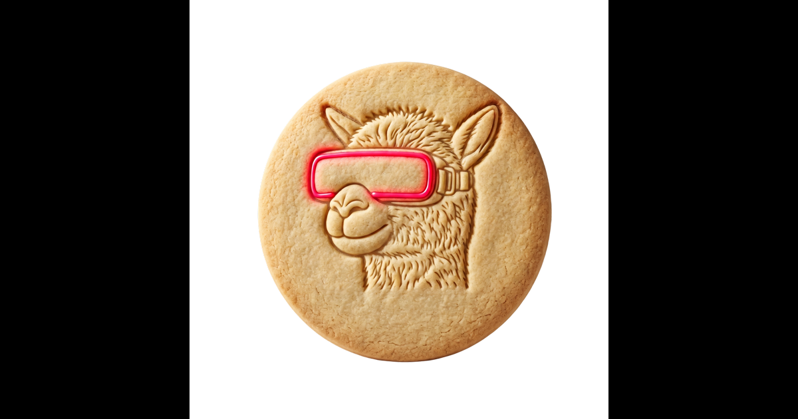

# CookSnipe

**New tokens on Cookie Chain are born, graduate or die inside a week — and getting in, getting out, and collecting what the launchpad owes you means bouncing between three different sites. CookSnipe does all three in one screen, on chain.**

Live app: **https://cooksnipe.sithunyein.com** · Network: **Cookie Chain** (`rpc.cookiescan.io`)

<p align="center">
  
</p>

---

## The problem

A launch on the [MomoSwap](https://momoswap.fun) bonding curve moves fast, and the money involved goes in four different directions that no single page shows you:

- **Entry and exit.** The launch page shows a pool; the curve sell is a separate action; the SPL tokens come later, if the pool graduates.
- **Refunds.** In fair mode, a pool that expires without graduating owes its holders the entire raise back, pro-rata. Nothing tells you it happened.
- **Settlement payouts.** Jackpot and survivor pools pay out through a merkle root. If you're in it, only a proof you have to go looking for will release the money.
- **Creator money.** Trade fees accumulate in a fee vault, and the vest unlocks on a schedule. Both sit there silently until claimed.

So traders either watch pools they shouldn't, or leave refunds and fees unclaimed because there is no screen that lists them.

## What CookSnipe does

| | |
|---|---|
| **Radar** | Every pool on the launchpad, polled live, sorted by state; new launches are flagged as they appear. |
| **Trade** | Buy and sell on the bonding curve with your own wallet — Nightly first — with a local quote, pool limits checked before you sign, six-stage progress, and an explorer link on confirmation. |
| **DEX exit** | For pools that graduated, an exit route quoted through the **Cookiebox** aggregator, with fee, price impact and the split path shown before signing. |
| **Portfolio** | Every curve position for an address, with invested / returned / open value read straight from the position account, plus the wallet's real token balances from the **Cookie DAS** index. |
| **Claim Center** | One scan that finds refunds, settlement payouts, graduated tokens, creator fees and creator vest across every pool — and claims them, or claims them all in sequence. |

## Required features (as the bounty lists them)

- **Wallet connection** — Wallet Standard discovery (`@wallet-standard/app`) with an injected-provider fallback. Nightly, Phantom, Backpack and Solflare are all detected; **Nightly is what Cookie Chain supports** and is highlighted in the picker, with an install link when nothing is detected.
- **Display the connected wallet address** — in the header, one click to copy, one click to open it on Cookiescan.
- **Transaction execution** — buy, sell, four claim kinds, creator-fee claims, and Cookiebox swaps, all built as unsigned transactions and signed by the user's wallet.
- **Transaction confirmation handling** — confirmation is tracked against the blockhash **and** `lastValidBlockHeight` the builder returned, so an expired transaction is reported as expired instead of hanging.
- **Error handling and user feedback** — program errors are translated into sentences ("Not enough COOK in this wallet to cover the amount plus network fees"), every stage is visible while it runs, and the RPC is checked against Cookie Chain's genesis hash before any signature is requested.

## Two things worth knowing about how this is built

**1. The wallet signs; CookSnipe broadcasts.** Wallets broadcast through their own RPC. On a custom SVM chain that RPC is Solana mainnet, where the transaction silently never confirms. So this app calls `signTransaction` only, then sends over `rpc.cookiescan.io` itself, and confirms there.

**2. Transactions are verified before they are signed.** The launchpad API returns a partially-signed transaction *plus* a description of it: fee payer, per-instruction program id, account order with signer/writable flags, and the SHA-256 of each instruction's data. CookSnipe decodes the bytes it was handed and compares them to that description — any disagreement (different program, changed data, a fee payer that isn't you, an account that just became writable) is a refusal, not a warning. Then it simulates before asking for a signature. `src/lib/tx.test.ts` covers the tamper cases.

## Cookie Chain integration

- **Launchpad program:** `momoL7wu4TrXjnXMLCLzGsbx8Pm7XGgoYo7FVqDoqcw` (`momoswap.fun` launchpad API, `api.momoswap.fun/v1/launchpad`)
- **RPC / WS:** `https://rpc.cookiescan.io` · `wss://wss.cookiescan.io` · genesis `9wDaBRDgArEUpvhHxGguNkwozsZh4UpGZB9o2EoEcBB2` (asserted before signing)
- **Cookie DAS:** `api.cookiescan.io` — `getAssetsByOwner` for wallet token balances, `/api/price/cook` for the COOK/USD figure shown next to claimable amounts
- **Cookiebox:** `agg.cookiebox.app` — `/quote` and `/swap-tx` for the post-graduation exit
- **Cookiescan:** every transaction, address and mint in the UI links to `cookiescan.io`
- **Bridge:** linked in the footer for anyone arriving without COOK

One structural note: on Cookie Chain the native mint is `So11111111111111111111111111111111111111112` — the *same string* as wSOL on Solana. The app branches on the chain, never on the mint.

## Run it locally

```bash
git clone https://github.com/thesithunyein/cooksnipe
cd cooksnipe
npm install
npm run dev          # http://localhost:5173
```

No environment variables and no keys: the launchpad API is proxied through `/api` in dev (`vite.config.ts`) and by a rewrite in production (`vercel.json`), because the upstream sends no CORS headers. Cookie DAS and the Cookiebox aggregator do send CORS headers, so they are called directly.

```bash
npm test             # 22 unit tests: curve math + transaction verification
npm run build        # tsc --noEmit && vite build
npm run preview      # serve the production build
```

Deploy: `vercel deploy --prod` (the rewrite in `vercel.json` is what keeps the API reachable in production).

## How it is put together

```
src/lib/          no React, all testable
  chain.ts        the only place that talks to the RPC; genesis guard; explorer URLs
  api.ts          launchpad HTTP client — builders only, never signs
  tx.ts           build → verify → simulate → sign → send → confirm, plus error translation
  wallet.ts       Wallet Standard + injected discovery, sign-only adapters
  curve.ts        BigInt port of the on-chain bonding-curve rounding
  cookiebox.ts    aggregator quotes and swap transactions
  das.ts          Cookiescan DAS assets + COOK price
src/app/          UI
  AppView.tsx     shell, tabs, network strip
  Radar / TokenDetail / TradePanel / DexExit / Portfolio / Claims
```

State is deliberately plain: polling in `useLaunches`, wallet state in `useWallet`, and transactions in `useTx` (one pipeline, reused by every action so the progress and error behaviour is identical everywhere).

## What it does not do yet

- **No history chart from the chain.** The price chart accumulates samples while a pool is open; it is not reconstructed from signatures, so a pool you open cold shows a short line.
- **Graduated token amounts are not pre-computed.** The program decides the conversion; the Claim Center shows the shares and names the token rather than guessing a number.
- **No `prefers-reduced-motion` pass** and no non-JS fallback — this is a wallet app, and it needs the wallet extension to do anything.
- **The launchpad API skips pools it cannot decode** (10 of 22 in a recent response). The app says so in a banner instead of quietly under-reporting.

## License

MIT — see [LICENSE](LICENSE).
